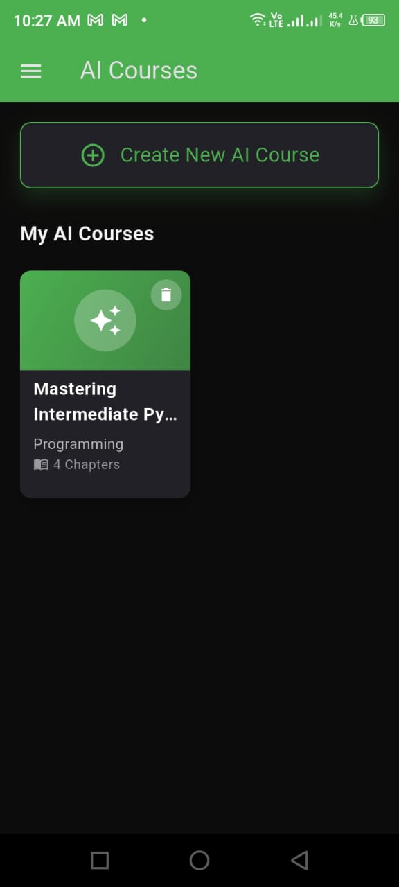
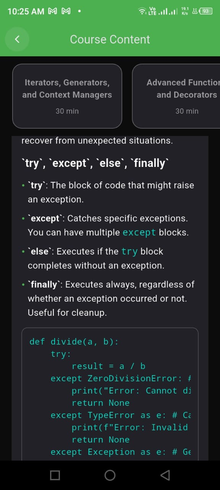
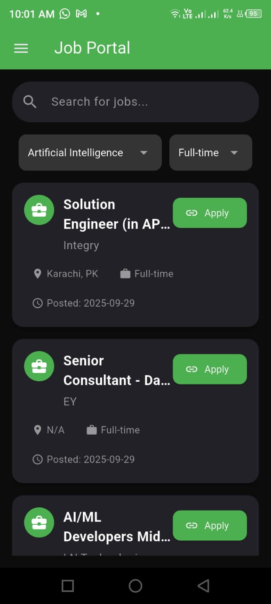

# Internovate - The Ultimate Internship Companion App 🚀

Welcome to the official repository for the **Internovate Mobile App**. This cross-platform application, built with Flutter, is the ultimate companion for students and aspiring professionals. It provides a complete ecosystem for internees to discover opportunities, manage their progress, and build their careers with powerful AI-driven tools, all within a beautiful and intuitive user interface.

<p align="center">
  
</p>

---

## ✨ Core Features

This app is packed with features to empower internees on their career journey:

- **🔐 Secure & Easy Authentication:** Simple and secure user registration and login using Firebase Authentication (Email/Password & Google Sign-In).
- **🏠 Dynamic Home Screen:** A personalized dashboard that displays promotional banners, internship categories, and the latest hackathons.
- **🗂️ Complete Internship Journey:** From application to certification, the app manages the entire lifecycle.
- **📊 Real-time Progress Tracking:** Monitor your internship completion with a clear and intuitive UI, including a detailed monthly progress graph.
- **🤖 Powerful AI-Powered Tools:**
    - **🧠 AI Resume Builder:** Automatically generates a professional, well-formatted resume based on user profile data.
    - **🎓 AI Course Generator:** Creates custom, structured course outlines on any topic to help users upskill.
- **🔔 Real-time Notifications:** Receive instant updates from the admin regarding application status, task reminders, and more, powered by OneSignal.
- **🏆 Hackathon & Job Hub:** Discover and apply for hackathons and jobs directly within the app.
- **📱 Professional & Responsive UI:** A consistent, beautiful, and user-friendly interface that works flawlessly on both Android and iOS.

---

## 🛠️ Technology Stack

- **Framework:** **Flutter** - For beautiful, fast, and native-feeling apps on both Android and iOS.
- **State Management:** **GetX** - For powerful and lightweight state, dependency, and route management.
- **Backend:** **Firebase**
    - **Firestore:** As the primary NoSQL database for real-time data.
    - **Authentication:** For secure user management.
- **Push Notifications:** **OneSignal** - For reliable and targeted user engagement.
- **AI Integration:** **Google's Gemini API** (via Firebase Cloud Functions) - To power the AI Resume Builder and Course Generator.

---

## 📸 Application Screenshots

A visual tour of the Internovate mobile app.

#### Onboarding & Authentication
A smooth and secure entry point for users.

<p align="center">
  
  
  
</p>
<p align="center">
  
  
  
</p>

#### Main Hub & Navigation
The central dashboard and easy navigation through a clean drawer.

<p align="center">
  
  
</p>

#### Internship Journey
From applying to completing tasks, the entire process is streamlined.

<p align="center">
  
  
  
</p>
<p align="center">
  
  
  
  
</p>

#### AI Resume Builder
Build a professional resume with the help of AI.

<p align="center">
  
  
  
</p>
<p align="center">
  
  
  
</p>

#### AI Course Generator
Generate custom course outlines on any topic instantly.

<p align="center">
  
  
  
</p>
<p align="center">
  
  
  
  
</p>
<p align="center">
  
  
  
  
  
</p>

#### Other Core Features
Job portal, hackathons, notifications, and more.

<p align="center">
  
  
  
  
</p>
<p align="center">
  
  
  
  
  
  
</p>

---

## 🚀 Getting Started

Follow these steps to get a local copy up and running.

1.  **Clone the Repository:**
    ```bash
    git clone <your-repository-url>
    ```
2.  **Install Dependencies:**
    ```bash
    flutter pub get
    ```
3.  **Configure Environment:**
    - Add your Firebase configuration files (`google-services.json` for Android, `GoogleService-Info.plist` for iOS).
    - Create a file `lib/api_key.dart` for sensitive keys (OneSignal, Gemini API) and add it to `.gitignore`.

4.  **Run the App:**
    ```bash
    flutter run
    ```