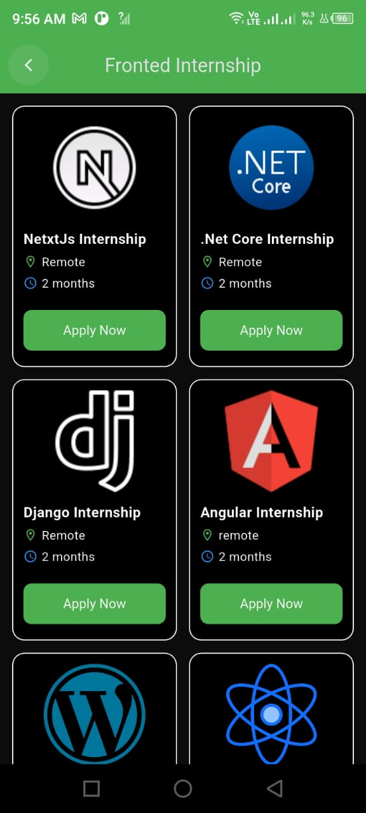

# Internovate - The Ultimate Internship Companion App 🚀

Welcome to the official repository for the **Internovate Mobile App**. This cross-platform application, built with Flutter, is the ultimate companion for students and aspiring professionals. It provides a complete ecosystem for internees to discover opportunities, manage their progress, and build their careers with powerful AI-driven tools, all within a beautiful and intuitive user interface.

<p align="center">
  
</p>

---

## ✨ Core Features

This app is packed with features to empower internees on their career journey:

- **🔐 Secure & Easy Authentication:** Simple and secure user registration and login using Firebase Authentication (Email/Password & Google Sign-In).
- **🏠 Dynamic Home Screen:** A personalized dashboard that displays promotional banners, internship categories, and the latest hackathons.
- **🗂️ Complete Internship Journey:** From application to certification, the app manages the entire lifecycle.
- **📊 Real-time Progress Tracking:** A dedicated profile screen with a cumulative progress graph to monitor internship performance.
- **🤖 Powerful AI-Powered Tools:**
    - **🧠 AI Resume Builder:** Automatically generates a professional, well-formatted resume based on detailed user input.
    - **🎓 AI Course Generator:** Creates custom, structured course outlines on any topic, complete with chapters and video suggestions.
- **🔔 Real-time Notifications:** Receive instant updates from the admin via OneSignal, with a badge for unread notifications.
- **🏆 Hackathon & Job Hub:** Discover and apply for hackathons and jobs directly within the app.
- **📱 Professional & Responsive UI:** A consistent, beautiful, and user-friendly interface that works flawlessly on both Android and iOS.

---

## 🛠️ Technology Stack

- **Framework:** **Flutter**
- **State Management:** **GetX**
- **Backend:** **Firebase** (Firestore, Authentication)
- **Push Notifications:** **OneSignal**
- **AI Integration:** **Google's Gemini API** (via Firebase Cloud Functions)

---

## 📸 A Visual Journey Through The App

Here is a detailed walkthrough of the app's features with screenshots.

### 1. Onboarding & Authentication
A smooth, secure, and welcoming entry point for every user, supporting both email and Google sign-in.

<p align="center">
  
  
  
  
</p>
<p align="center">
  
  
</p>

### 2. Main Dashboard & Navigation
The home screen serves as the central hub, providing easy access to all features. The side drawer allows for quick navigation.

<p align="center">
  
  
</p>

### 3. The Complete Internship Lifecycle
From finding the right opportunity to submitting tasks and earning a certificate.

#### Applying for an Internship
Users can browse categories, select an internship, and fill out a detailed application form.
<p align="center">
  
  
  
</p>

#### Tracking Progress and Completing Tasks
Once accepted, internees can view their overall progress and manage their tasks. They can view task descriptions and submit their work via LinkedIn, GitHub, or live deployment links.
<p align="center">
  
  
  
  
</p>

#### Receiving the Certificate
Upon successful completion, users can view, download, and share their certificate.
<p align="center">
  
</p>

### 4. AI Resume Builder
A step-by-step tool that gathers all necessary information and uses AI to generate a polished, professional resume ready to be downloaded and shared.

<p align="center">
  
  
  
</p>
<p align="center">
  
  
  
</p>

### 5. AI Course Generator
A cutting-edge feature that allows users to create custom course outlines on any topic. The app guides the user through selecting a category, topic, and options, then generates a complete course structure, including detailed content and suggested video tutorials.

<p align="center">
  
  
  
  
</p>
<p align="center">
  
  
  
</p>
<p align="center">
  
  
  
  
  
</p>

### 6. Additional Features
The app also includes a Job Portal, a Hackathons section, a detailed User Profile, a Contact Us form, and a Notification center.

<p align="center">
  
  
  
  
</p>
<p align="center">
  
  
  
</p>
<p align="center">
  
  
</p>

---

## 🚀 Getting Started

Follow these steps to get a local copy up and running.

1.  **Clone the Repository:**
    ```bash
    git clone <your-repository-url>
    ```
2.  **Install Dependencies:**
    ```bash
    flutter pub get
    ```
3.  **Configure Environment:**
    - Add your Firebase configuration files (`google-services.json` for Android, `GoogleService-Info.plist` for iOS).
    - Create a file `lib/api_key.dart` for sensitive keys (OneSignal, Gemini API) and add it to `.gitignore`.

4.  **Run the App:**
    ```bash
    flutter run
    ```